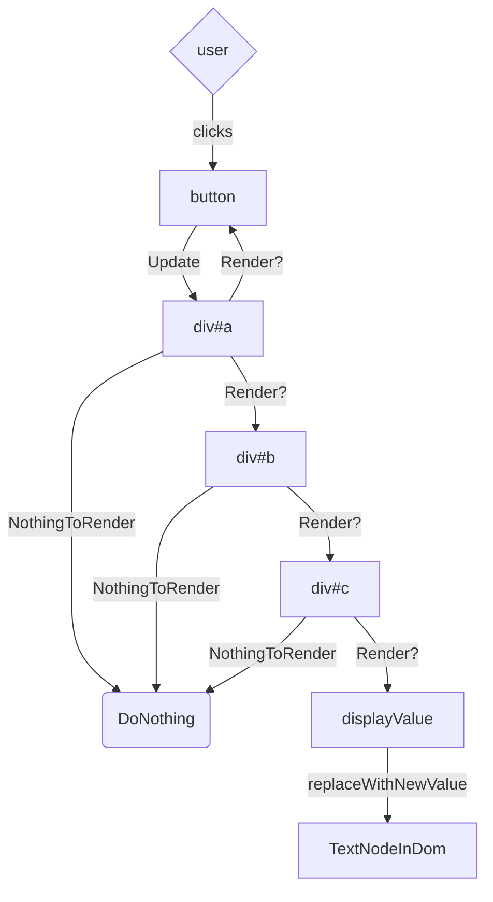
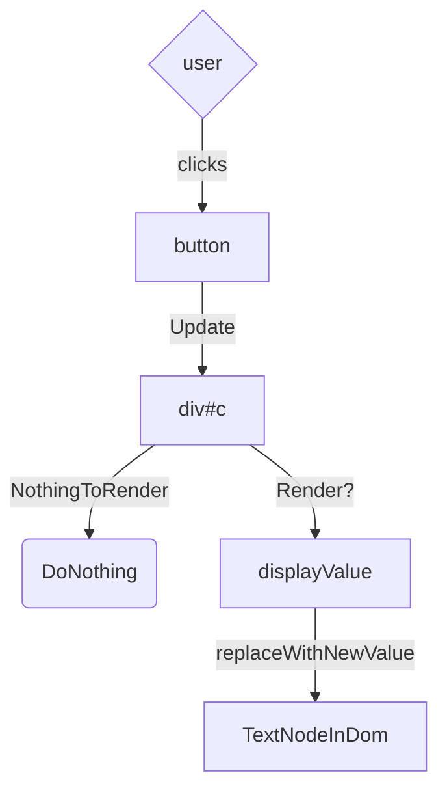

# Xip 

Xip is a performant UI framework with declarative components and flexible state

# Features
- Surgical updates with minimal overhead
- Powerful extension api
- Simple and flexible state management
- Only 1.6 kB gzip

---


# Contents
- [Install](#Install)
	- [⚡Quick Start](#⚡Quick-Start)
	- [📦 NPM](#📦NPM)
	- [📮CDN](#📮CDN)
- [Build a Basic Counter](#Build-a-Basic-Counter)
- [URL Routing](#URL-Routing)
- [Reactivity and State Management](#Reactivity-and-State-Management)
- [The 3 Functions](#The-3-Functions)
	- [Engage](#Engage)
	- [ref](#ref)
	- [el](#el)
- [Element Attributes](#Element-Attributes)
- [Direct Element Access](#Direct-Element-Access)
- [Dom Events](#Dom-Events)
- [Behaviour and Optimisation](#Behaviour-and-Optimisation)
	- [UML](#UML)
- [Intercept Element Removal](#Intercept-Element-Removal)
- [In HTML](#In-HTML)
- [Syntax]([#Syntax)
	- [JSX](#JSX)
	- [HyperScript](#HyperScript)
- [Contact](#Contact)
- [Licence](#licence)

---


# Install

## ⚡Quick Start

1. Clone the template project:

```shell
git clone https://github.com/xipjs/Examples/Template.git
```

2. Install:

```shell
npm install
```

3. Start Live Development Server:

```shell
npm run dev
```

4. Once your App is Done, Build:

```shell
npm run build
```


## 📦 NPM

```shell
npm i @xipjs/xip
```


## 📮CDN

```html
<script src="https://github.com/xipjs/Build/xip.min.cjs"></script>
```

See [In HTML](#In-HTML) for more info

---


# Build a Basic Counter

1. Define the "Counter" component
```jsx
function Counter() {
  // define the count state
  let count = ref(0);
  return (
    <span>
      {/* tell the h1 to react to the count state */}
      <h1 react={count.Reg}>{() => count.value}</h1>
      {/* add buttons to update the count causing the h1 to update */}
      <button onClick={() => count.Set(count.value + 1)}>+</button>
      <button onClick={() => count.Set(count.value - 1)}>-</button>
      <hr />
    </span>
  );
}
```

2. Add the "Counter" component to the dom
```jsx
Engage(Counter, (el) => document.body.replaceChildren(el));
```

---


# URL Routing

An example of no-reload url routing:

App.jsx
```jsx
import Docs from "./Components/Docs/Docs";
import Examples from "./Components/Examples/Examples";
import Home from "./Components/Home/Home";
import TopBar from "./Components/NavBar/NavBar";
import { State } from "./State";

export default function App() {
  return (
    <div class="App">
      <NavBar />
      <Router />
    </div>
  );
}
```

NavBar.jsx
```jsx
import { State } from "../../State";

const Redirect = (path) => () => State.Path.Set(path);

export default function NavBar() {
  return (
    <nav>
      <a onClick={Redirect("/Home")}>Home</a>
      <a onClick={Redirect("/Docs")}>Docs</a>
      <a onClick={Redirect("/Examples")}>Examples</a>
    </nav>
  );
}
```

Router.jsx
```jsx
function Router() {
  return (
    <span react={State.Path.Reg}>
      {() => {
        switch (State.Path.value) {
          case "/Home":
            return <Home />;
          case "/Docs":
            return <Docs />;
          case "/Examples":
            return <Examples />;
          default:
            // If path is not available redirect to /Home
            State.Path.Set("/Home");
            return;
        }
      }}
    </span>
  );
}
```

State.js
```js
// Define a Global State object
export const State = {
// Set the initial State to the URL path
  Path: ref(window.location.pathname),
  // just for nicer components
  Redirect(path) => () => State.Path.Set(path);
};
// Add a subscriber to update the url when "State.Path" changes
State.Path.Reg(() => {
  let l = State.Path.value.split("/");
  // Update URL Without reloading the page
  window.history.pushState("", l[l.length - 1], State.Path.value);
});
```

---


# Reactivity and State Management

State can be defined anywhere and in any form (e.g: class, object, varible), to make a value reactive wrap it in the [ref()](#`ref()`) function:
```jsx
// non reactive
let count = 0
// reactive
let count = ref(0)
// use the value of count
let component = <div>{count.value}</div>
```
by default nothing will react to "count" so:

Make the component react to count:
```jsx
let component = <div react={count.Reg}>{count.value}</div>
```
Now the component will check if it can update when "count" is triggered, but even if the value of "count" has changed, the renderer has already evaluated "count.value" and so no changes will be made to the dom.

Only values wrapped in closures can be reevaluated:
```jsx
let component = <div react={count.Reg}>{()=>count.value}</div>
```
On the initial render "()=>count.value" will be remembered as a renderable before being evaluated and applied to the dom, then when the component is asked to rerender, it will reevaluate "()=>count.value" and directly update that text node in the dom.

---


# The 3 Functions

## `Engage()`

```ts
function Engage(
  Ui: () => CDN,
  cb: (e: Element | any, r: () => void) => void
): void {}
```

### Usage:

The first parameter is the Component to be rendered and the second is a callback to add the component to the dom

```js
Engage(App, (element) => document.body.replaceChildren(element));
```

## `ref()`

```ts
function ref<Type>(ival: Type): refHook<Type>;
```

### Usage:

```jsx
// define count with an initial value of 0
let count = ref(0)

// Call listeners without updating the value
count.Trigger()

// Set a new value and call listeners
count.Set(1)

// update the last value and call listeners
count.update(v => v+1)

// adds a listener and returns a function to remove the listener
let remove = count.Reg(()=>console.log("count updated"))

// Define a state anywhere with any value
let Gallary = {
	Loaded: ref(false),
	images: ref([]),
	SearchQuery: ref("")
	// Register a ui component to update in response to count being updated
	Ui: <div react={count.Reg}>Loaded {Count.Value} Images</div>
}

// Register for state changes
Gallary.Loaded.Reg(() => console.log("Images Loaded"));
Gallary.Images.Reg(() => count.Set(Gallary.Images.value.Length));

// Only Subscribe once
let cancel = Gallary.Images.Reg(() => {console.log("First Image Loaded");cancel()});
```

## `el()`

```ts
function el(
  type: string,
  Attributes: ElementAttributes,
  ...Children: any[]
): ElementDomNode;
```

### Usage:

```js
// used to define html elements
let Component = el("div", { class: "container" });

// optional children
let Component = el("div", { class: "container" }, "hello world");

// unlimited children
let Component = el("div", { class: "container" }, "hello world", el("div", {}));

// Nested
let Component = el(
  "div",
  { class: "container" },
  el(
    "span",
    { id: "1" },
    el("button", { onClick: () => console.log("pressed") }, "press")
  )
);
```

`el()` can be called using jsx or tsx, for example these two components are identical, only using different syntax:

```tsx
<div class="container">container<div/>
```

will call `el()` like this:

```js
el("div", { class: "container" }, "container");
```

see [Syntax](#Syntax)

---


# Element Attributes

```typescript
export interface XipElementAttributes {
  // Selectors
  id?: string; // html id
  class?: string; // html class
  className?: string | (() => string); // Reactive class

  // Inline Style
  style?: string; //html style
  Style?: CSSStyleDeclaration;
  reStyle?: (style: CSSStyleDeclaration) => void;

  // Render Stages
  withRender?: (e?: Element) => void; // While the component is being built
  onDom?: (e?: Element) => void; // As soon as the component is added to the dom
  onRemove?: (e?: Element) => Promise<any>; // Before the component leaves the dom

  // Dom Events
  on?:
    | [EventName: string, CallBack: (event?: Event) => void] // calls element.addEventListener(EventName, CallBack);
    | [[EventName: string, CallBack: (event?: Event) => void]]; // use a 2d arry to add multiple event listener's
  onClick?: (event?: Event) => void;
  onInput?: (event?: Event) => void;
  onSubmit?: (event?: Event) => void;
  onContextMenu?: (event?: Event) => void;

  // Other
  x?: (api: EAPI) => void | [(api: EAPI) => void]; // pass 1, or an array of extensions
  focus?: boolean; //
  getRemover?: (remove: () => void) => void; // receive a callback to safely remove the element
  HotProps?: () => ElementAttributes; // Runs when the element is told to Re-render and directly applies the new attributes without re-rendering
  react?:
    | ((func: () => void) => () => void) // Receive a re-render function and return a cleanup function
    | [(func: () => void) => () => void]; // Register multiple with an array

  [key: string]: any; // add attributes to the dom element
}
```

---


# Direct Element Access

Three of the [[#Element Attributes]] provide direct access to the dom element at different stages:

- `withRender()` while being created
- `onDom()` once added to the dom
- `onRemove()` before the element is removed, see [[#Intercept Element Removal]]
  Each of these functions are provided with the same dom element pointer.
  For access outside of the element use `withRender()` for predisplay delivery:

```jsx
import { State } from "../../State";

var CurrentFormPointer;

const MakeFormRed = () => {
  CurrentFormPointer.style.color = "red";
};

export default function NavBar() {
  return (
    <form withRender={(e) => (CurrentFormPointer = e)}>
      <button onClick={makeFormRed}>Make Form Red</button>
    </form>
  );
}
```

---


# Dom Events

For events not defined in [[#Element Attributes]] use the `on` attribute:

```jsx
<div on={["click", (e) => console.log(e)]}></div>
```

and use an array for multiple events on a single element:

```jsx
<div
  on={[
    ["click", (e) => console.log(e)],
    ["mouseover", (e) => console.log(e)],
  ]}
></div>
```

---


# In HTML

JSX cannot be interpreted by a browser,
so we use [[#HyperScript]] syntax instead.

## Counter Example

Past this into `index.html` and open in a browser to test

```html
<!DOCTYPE html>
<html lang="en">
  <head>
    <meta charset="UTF-8" />
    <meta name="viewport" content="width=device-width, initial-scale=1.0" />
    <title>Counter</title>
    <script defer src="https://github.com/xipjs/Build/xip.min.js"></script>
  </head>
  <body></body>
  <script>
    function Counter(Remove) {
      let count = ref(0);
      return el(
        "div",
        { react: count.Reg },
        el("h1", {}, () => count.value),
        el("button", { onClick: () => count.Update((v) => v + 1) }, "+"),
        el("button", { onClick: () => count.Set(count.value - 1) }, "-"),
        el("hr", {})
      );
    }
    Engage(Counter, (el) => document.body.replaceChildren(el));
  </script>
</html>
```

## Add Elements Dynamically along side html elements

_warning:_ removing an element with a selector can cause a memory leak, always use the Remove function provided as the second argument to the  `Engage()` callback function:
``` js
Engage(App, (el, Remove) => {});
```

```html
<!DOCTYPE html>
<html lang="en">
  <head>
    <meta charset="UTF-8" />
    <meta name="viewport" content="width=device-width, initial-scale=1.0" />
    <title>CrystalApp</title>
    <script src="https://github.com/xipjs/Build/xip.min.js"></script>
  </head>
  <body>
    <button onclick="NewCounter()">New</button>
  </body>
  <script>
    function Counter(Remove) {
      let count = ref(0);
      return el(
        "div",
        { react: count.Reg },
        el("h1", {}, () => count.value),
        el("button", { onClick: Remove }, "Remove"),
        el("button", { onClick: () => count.Set(count.value + 1) }, "+"),
        el("button", { onClick: () => count.Set(count.value - 1) }, "-"),
        el("hr", {})
      );
    }
    function NewCounter() {
      // Activate a new Counter Component
      let instance = Engage(
        () => Counter(instance.Remove),
        (el) => {
          document.body.replaceChildren(el);
        }
      );
    }
  </script>
</html>
```

---


# Behaviour and Optimisation

## UML

The following examples demonstrate how components are rendered and how the prosses can be optomised.

```tsx
let component = () => {
  let word = ref("Hello");

  function Update() {
    // Switch between "Hello" and "World"
    word.Update((v) => (v === "hello" ? "World" : "Hello"));
  }
  let displayValue = () => word.value;
  return (
    <div id="a" react={word.Reg}>
      <button onClick={Update}>change</button>
      <div id="b">
        <div id="c">{displayValue}</div>
      </div>
    </div>
  );
};
```


Optamised:
```tsx
let component = () => {

  let word = ref("Hello");

  function Update() {
    // Switch between "Hello" and "World"
    word.Update((v) => (v === "hello" ? "World" : "Hello"));
  }
  
  let displayValue = () => word.value;
  
  return (
    <div id="a">
      <button onClick={Update}>change</button>
      <div id="b">
        <div id="c" react={word.Reg}>
          {displayValue}
        </div>
      </div>
    </div>
  );
};
```


---


# Intercept Element Removal

Usually used for exit animations or ensuring data from the dom is correctly captured.

If the `onRemove` element attribute returns a promise. The renderer will wait for the promise to be resolved before removing that element, and if it rejects the element won't be removed.
Any updates that do not result in the removal of the element will still work while waiting for the promise to resolve (The application will remain responsive, including children of the intercepted element).


---


# Syntax

JSX and Hyperscript are two syntax options to represent html inside JavaScript, neither has capability the other doesn't, except that Hyperscript is valid JavaScript, so JSX must be converted to hyperscript before being executed by the browser.

## HTML Comparison

The following 3 examples are HTML, JSX and Hyperscript producing identical results:

HTML:
```html
<form id="form-id">
  <input type="text" />
  <input type="checkbox" name="checkbox" id="1" />
  <button type="submit">Submit</button>
</form>

<script>
  document
    .getElementById("form-id")
    .addEventListener("submit", (e) => console.log(e));
</script>
```

JSX:
```jsx
let component = () => {
  return (
    <form onSubmit={(e) => console.log(e)}>
      <input type="text" />
      <input type="checkbox" name="checkbox" id="1" />
      <button type="submit">Submit</button>
    </form>
  );
};
```

Hyperscript
```js
let component = () => {
  return el(
    "form",
    { onClick: (e) => console.log(e) },
    el("input", { type: "text" }),
    el("input", { type: "checkbox", name: "checkbox", id: "1" }),
    el("button", { type: "submit" }, "Submit")
  );
};
```

---


# Contact

xipjs@proton.me

---

# Licence

[MIT]()
